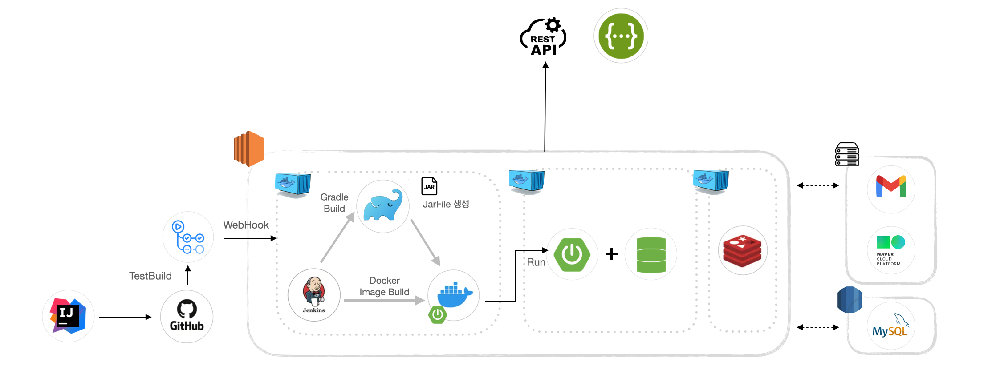
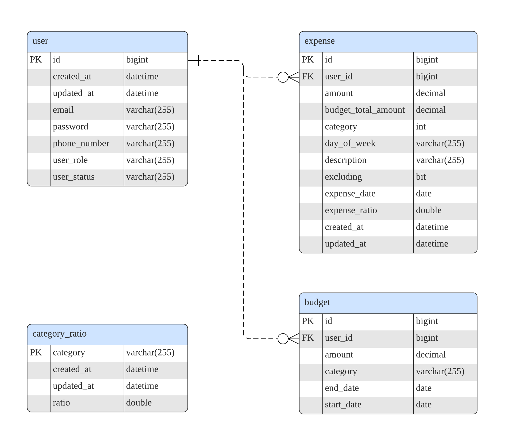

# 예산 관리 서비스

## 목차
- [개요](#개요)
- [사용기술](#사용기술)
- [API 문서](#API-명세)
- [구현 기능](#구현기능)
- [시스템 구성도](#시스템-구성도)
- [ERD](#ERD)

## 개요

본 서비스는 사용자들이 개인 재무를 관리하고 지출을 추적하는 데 도움을 주는 애플리케이션입니다.  
이 앱은 사용자들이 예산을 설정하고 지출을 모니터링하며 재무 목표를 달성하는 데 도움이 됩니다

## 사용기술
#### 백엔드
   

#### 데이터베이스
   

#### 배포환경
  
 
 

#### 외부연동
 

#### 테스트
 

#### 기타
  

## API 명세

[-85EA2D.svg?style=for-the-badge&logo=swagger&logoColor=white)](http://13.209.237.7/swagger-ui/index.html)

| Category     | HTTP Method | Endpoint                                        | Description               |
|--------------|-------------|-------------------------------------------------|---------------------------|
| User API     | POST        | `/api/v1/users`                                 | 사용자 등록                |
|              | GET         | `/api/v1/users/{userId}/verification`            | 사용자 이메일 인증          |
|              | POST        | `/api/v1/users/otp/request`                     | OTP 전송                   |
|              | POST        | `/api/v1/users/otp/verification`                | OTP 인증                   |
|              | POST        | `/api/v1/users/sign-in`                         | 사용자 로그인               |
| Budget API   | GET         | `/api/v1/budgets`                               | 예산 설정 조회              |
|              | POST        | `/api/v1/budgets`                               | 예산 설정                  |
|              | DELETE      | `/api/v1/budgets/{budgetId}`                    | 예산 설정 삭제             |
|              | PATCH       | `/api/v1/budgets/{budgetId}`                    | 예산 설정 수정             |
|              | GET         | `/api/v1/budgets/categories`                    | 예산 카테고리 조회          |
|              | GET         | `/api/v1/budgets/recommendation/amount/{amount}` | 예산 추천                   |
| Expense API  | GET         | `/api/v1/expenses`                              | 지출 조회                   |
|              | POST        | `/api/v1/expenses`                              | 지출 등록                   |
|              | DELETE      | `/api/v1/expenses/{expenseId}`                  | 지출 삭제                   |
|              | PATCH       | `/api/v1/expenses/{expenseId}`                  | 지출 수정                   |
| Statistic API| GET         | `/api/v1/statistics/category`                   | 통계 조회                   |
|              | GET         | `/api/v1/statistics/day-of-week`                | 지난 요일 대비 통계 조회    |
|              | GET         | `/api/v1/statistics/other-users`                | 다른 사용자 통계 조회       |

## 구현기능

#### 휴대폰 OTP 인증 (API)
- 휴대폰 번호를 입력하여 인증번호를 전송합니다.
- 인증번호는 레디스 저장소에 3분간 저장되며 이후 만료됩니다.

#### 사용자 회원가입(API)
- 본 서비스에서는 유저 고유 정보가 크게 사용되지 않아 간단히 구현합니다.
- `계정명` , `패스워드` 입력하여 회원가입

#### 이메일 인증 (API)
- 회원가입 진행 시 입력된 이메일로 이메일 인증을 진행합니다.
- 이메일 인증을 진행하지 않은 사용자는 로그인이 불가능합니다.

#### 사용자 로그인(API)
- `계정`, `비밀번호` 로 로그시 `JWT` 가 발급됩니다.
- 이후 모든 API 요청 Header 에 `JWT` 가 항시 포함되며, `JWT` 유효성을 검증합니다.

#### 카테고리 목록(API)
- 유저가 예산설정에 사용할 수 있도록 모든 카테고리 목록을 반환합니다.

#### 예산 설정(API)
- 해당 기간 별 설정한 `예산` 을 설정합니다. 예산은 `카테고리` 를 필수로 지정합니다.
    - ex) `식비` : 40만원, `교통` : 20만원
- 사용자는 언제든지 위 정보를 변경할 수 있습니다.

#### 예산 설계 (=추천) (API)
- 카테고리 별 예산 설정에 어려움이 있는 사용자를 위해 예산 비율 추천 기능이 존재합니다.
- `카테고리` 지정 없이 총액 (ex. 100만원) 을 입력하면, `카테고리` 별 예산을 자동 생성합니다.
- 자동 생성된 예산은, 기존 이용중인 `유저` 들이 설정한 평균 값 입니다.
    - 유저들이 설정한 카테고리 별 예산을 통계하여, 평균적으로 40% 를 `식비`에, 30%를 `주거` 에 설정 하였다면 이에 맞게 추천.
    - 10% 이하의 카테고리들은 모두 묶어 `기타` 로 제공한다.(8% 문화, 7% 레져 라면 15% 기타로 표기)
    - **위 비율에 따라 금액이 입력됩니다.**
        - **ex) 식비 40만원, 주거 30만원, 취미 13만원 등.**

#### 지출 CRUD (API)
- 지출을 `생성`, `수정`, `읽기(상세)`, `읽기(목록)`, `삭제` , `합계제외` 할 수 있습니다.
- `생성한 유저`만 위 권한을 가집니다.
- `읽기(목록)` 은 아래 기능을 가지고 있습니다.
    - 필수적으로 `기간` 으로 조회 합니다.
    - 조회된 모든 내용의 `지출 합계` , `카테고리 별 지출 합계` 를 같이 반환합니다.
    - 특정 `카테고리` 만 조회.
    - `최소` , `최대` 금액으로 조회.
        - ex) 0~10000원 / 20000원 ~ 100000원
- `합계제외` 처리한 지출은 목록에 포함되지만, 모든 `지출 합계`에서 제외됩니다.

#### 오늘 지출 추천(스케줄러-매일 08:00)
- 설정한 `월별` 예산을 만족하기 위해 오늘 지출 가능한 금액을 `총액` 과 `카테고리 별 금액` 으로 제공합니다.
    - ex) 11월 9일 지출 가능 금액 총 30,000원, 식비 15,000 … 으로 페이지에 노출 예정.

#### 오늘 지출 안내(스케줄러-매일 20:00)
- 오늘 지출한 내용을 `총액` 과 `카테고리 별 금액` 을 알려줍니다.
- `월별`설정한 예산 기준 `카테고리 별` 통계 제공
    - 일자기준 오늘 `적정 금액` : 오늘 기준 사용했으면 적절했을 금액
    - 일자기준 오늘 `지출 금액` : 오늘 기준 사용한 금액

#### 지출 통계 (API)
- `지난 달` 대비 `총액`, `카테고리 별` 소비율 조회
    - 오늘이 10일차 라면, 지난달 10일차 까지의 데이터를 대상으로 비교
    - ex) `식비` 지난달 대비 150%
- `지난 요일` 대비 소비율
    - 오늘이 `월요일` 이라면 지난 `월요일` 에 소비한 모든 기록 대비 소비율
    - ex) `월요일` 평소 대비 80%
- `다른 유저` 대비 소비율
    - 오늘 기준 다른 `유저` 가 예산 대비 사용한 평균 비율 대비 나의 소비율
    - 오늘기준 다른 유저가 소비한 지출이 평균 50%(ex. 예산 100만원 중 50만원 소비중) 이고 나는 60% 이면 120%.
    - ex) `다른 사용자` 대비 120%
  
## 프로젝트 구조

## ERD
